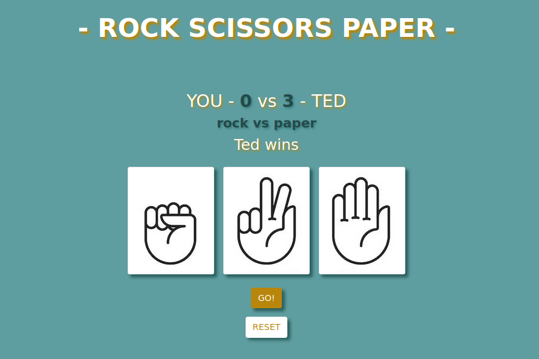

# Rock-scissors-paper
Creating a simple Js game

[Check out my version.](https://yurifra.github.io/Rock-scissors-paper/)

- Repository: `rock-scissors-paper`
- Type of Challenge: `Learning Challenge`
- Duration: 1 day
- Deployment strategy : Github page
- Team challenge : `solo`

## Learning objectives
- generate random 
- if statements

## The Mission
Make a rock-scissors-paper game:

- Have three buttons that the player can press to change their pick
- Have another button to let the computer pick one and show the winner
- Let the player know they won (no alert box)
- Have a reset button

